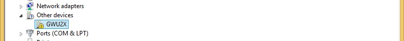
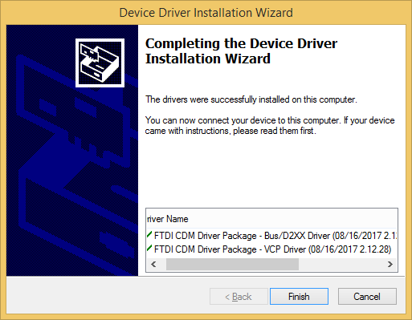
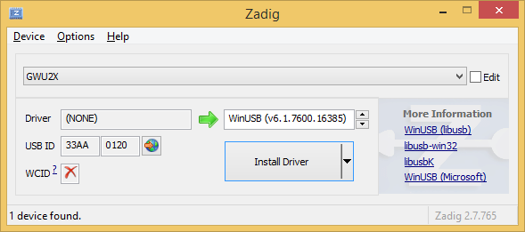
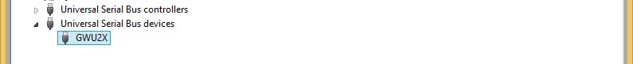
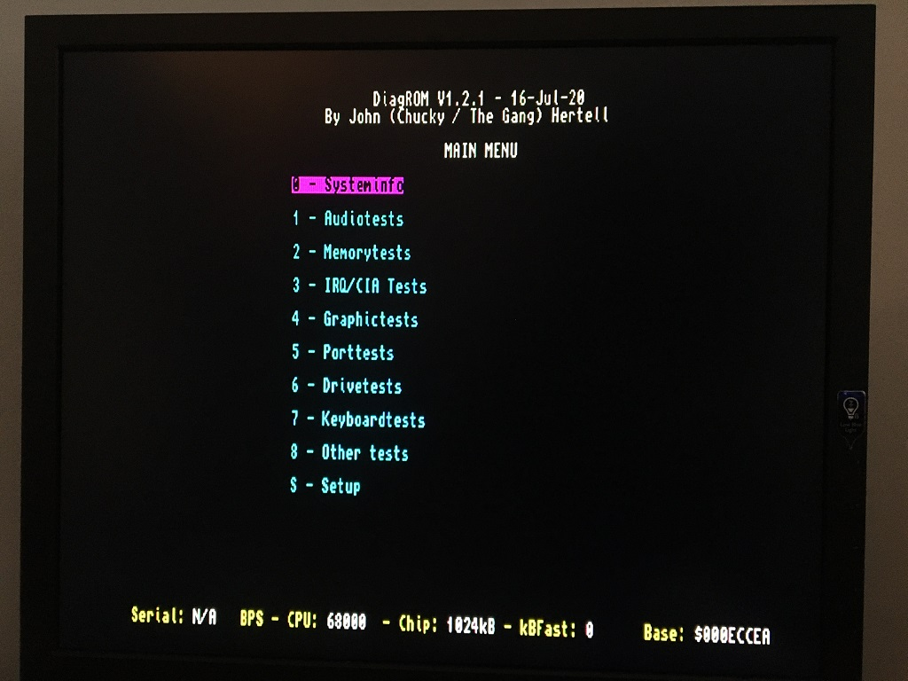

# SF2000-FW
Firmware for the Spitfire 2000 Amiga Accelerator written in Verilog

***

This is WORK IN PROGRESS, a DIY hobby project. If you are going to make and sell boards you are also the one doing the customer support. Also if you are going to build boards and sell for profit, you will need a consent from Matthias Heinrichs (Matze) and also from Oliver Kastl if you are going to bundle this software http://aminet.net/package/disk/misc/oktapus with the hardware (ROM-chip, U14).

Many thanks to [LIV2](https://github.com/LIV2/) (Matt Harlum) for contributing the sfflash-tool software, please note it is under a different license (`GPL-2.0-only`, Copyright (C) 2023 Matthew Harlum <matt@harlum.net>)

***

In order to program the Gowin FPGA a `U2X`-dongle can be used:
 
https://www.amazon.co.uk/Gowin-GOWIN-USB-Dongle-U2X/dp/B09S3D65D4
 
 
Both SRAM and the embedded Flash can be programmed with it:
 
 

 
 
The USB-dongle connects to the JTAG-pins on the Accelerator board:
 
 

 
 
Device drivers for the dongle has to be installed:
 
 

 
 

 

 
 

 
 
Using LIV2's sfflash tool you simply copy the sfflash binary to your Amiga together with the ROM-image file and type the command.
 
Please note the image can not be byteswapped, we are on the Amiga and the 68k which is big-endian. On the SF2000 you need to close JP9 in order to use the ROM overlay after programming it. When programming JP9 has to be open and the system loaded from the Motherboard ROM.
 
 

 

 

***

Happy Hackin' 

***

[![CC BY-SA 4.0][cc-by-sa-shield]][cc-by-sa]

This work is licensed under a
[Creative Commons Attribution-ShareAlike 4.0 International License][cc-by-sa].

[![CC BY-SA 4.0][cc-by-sa-image]][cc-by-sa]

[cc-by-sa]: http://creativecommons.org/licenses/by-sa/4.0/
[cc-by-sa-image]: https://licensebuttons.net/l/by-sa/4.0/88x31.png
[cc-by-sa-shield]: https://img.shields.io/badge/License-CC%20BY--SA%204.0-lightgrey.svg
